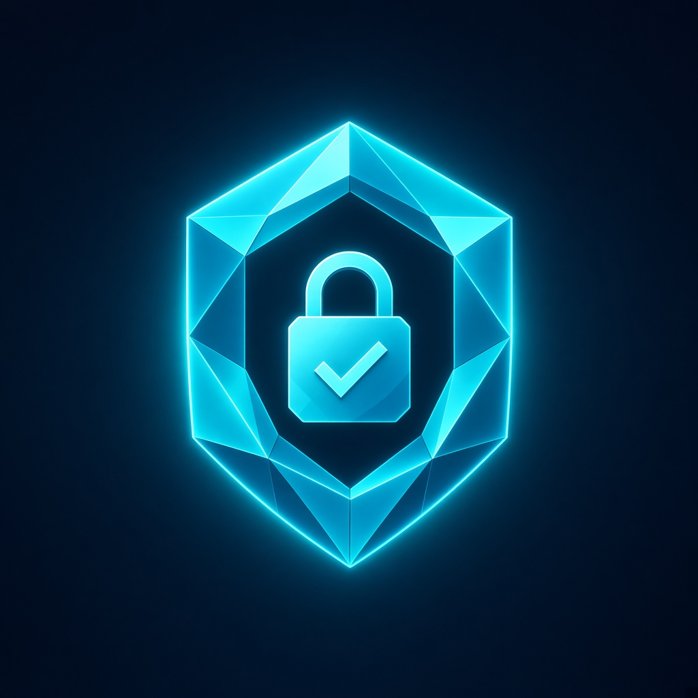

# DualSource Desk

<p align="center"></p>

**Two sources disagree. Which one answers the question?** DualSource Desk is a web app for resolving a question against
two web sources on GenLayer. Validators freeze both pages under SHA-256 consensus, and the verdict (`favor`: `a`, `b` or
`tie`) is settled on the frozen text only, never on live pages that may change later.

| | |
|---|---|
| **Live app** | https://valentinzubok.github.io/DualSourceDesk/ (mirror: https://dualsourcedesk.vercel.app) |
| **Contract** | Studio Dev (chain 61997) [`0xF4402034209D51F683ae5BC61ddd6b1AdC610ED3`](https://explorer-studio-dev.genlayer.com/address/0xF4402034209D51F683ae5BC61ddd6b1AdC610ED3) |
| **Source verification** | on-chain code sha256 = [`contracts/DualSource.py`](contracts/DualSource.py) (`325e8aa7…`), see [`STUDIO_DEV_DEPLOY.md`](STUDIO_DEV_DEPLOY.md) |
| **Demo video** | [`assets/demo/dualsource-desk-demo.mp4`](https://github.com/valentinzubok/DualSourceDesk/blob/main/assets/demo/dualsource-desk-demo.mp4) (2:14, real Studio Dev txs) |
| **Standalone contract** | [valentinzubok/DualSource](https://github.com/valentinzubok/DualSource) (accepted Intelligent Contract) |

## How GenLayer is used

```
open_question(id, question)
attach_source(id, url_a)   ─┐  validators fetch the page, normalize it and agree on its SHA-256
attach_source(id, url_b)   ─┘  (eq_principle.strict_eq); the preview and hash are frozen on chain
settle(id)
  ├─ hash_a == hash_b → favor = "tie"              (deterministic, no LLM)
  └─ otherwise        → validators' LLMs read the FROZEN previews and agree on
                        {"prefer_a": bool} via prompt_comparative → favor = "a" | "b"
```

## The app

`web/` is a Next.js console built on `genlayer-js` + MetaMask:

- **Reads without a wallet.** Owner, stats, and every question with its status, `favor`, and each source's frozen sha256 come straight from `get_question` / `list_ids` / `get_stats`.
- **Writes through MetaMask.** `open_question`, `attach_source`, `settle`. The app adds or switches the wallet to chain 61997, attaches the Studio Dev fee deposit to every transaction, waits for consensus (`ACCEPTED`), refreshes from chain, and links the tx to the explorer.
- **Get test GEN.** A Studio faucet button for fees.

### Reproduce

1. Open the live app. `q1` (`tie`) and `q2` (`favor=a`) load from chain.
2. **Connect MetaMask** (switches to 61997) → **Get test GEN**.
3. Enter a new `question_id` and question → **open_question**.
4. **attach_source** with URL A, then with URL B (two different pages).
5. **settle** → the row shows `favor` and both frozen hashes.

### Run locally

```bash
cd web
npm install
npm run dev   # http://localhost:3012
```

`NEXT_PUBLIC_DUALSOURCE_ADDRESS` overrides the contract (defaults to the live Studio Dev deploy).
